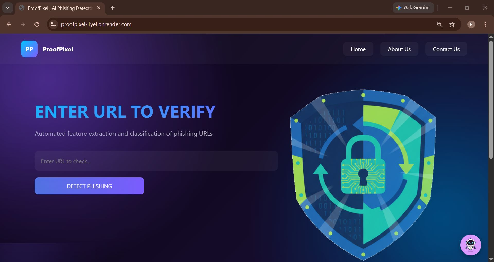
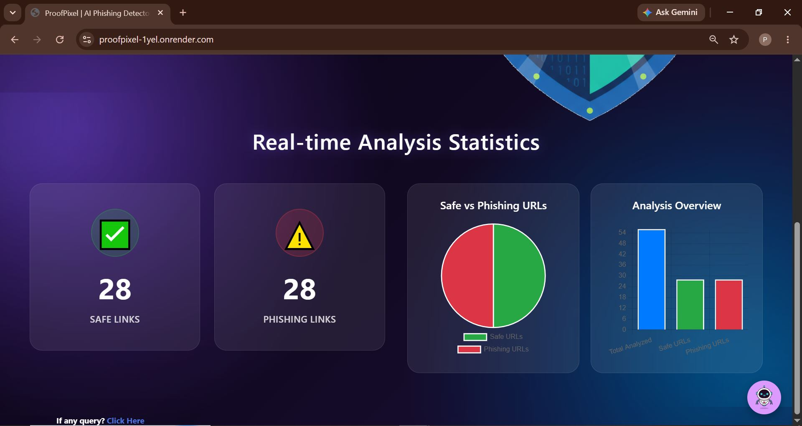

# ProofPixel: An Intelligent System for Detecting Fake and Malicious Links
An AI-powered web application that detects phishing URLs using Machine Learning and provides cybersecurity guidance through an integrated AI chatbot.

## Project Overview

ProofPixel is a machine learning-based phishing URL detection system designed to identify malicious websites before users visit them. The application analyzes various lexical and structural characteristics of URLs using a trained Random Forest classifier and predicts whether a URL is Safe or Phishing.

To improve user awareness, ProofPixel also integrates an AI-powered cybersecurity chatbot that answers security-related questions and educates users about phishing attacks and online safety.

The project aims to provide a fast, lightweight, and user-friendly solution for enhancing cybersecurity.

## Features
1. Detects phishing URLs using Machine Learning
2. AI-powered cybersecurity chatbot (OpenRouter API)
3. Fast URL prediction with Flask REST API
4. Random Forest model with 96% accuracy
5. URL analysis statistics dashboard
6. Stores scanned URLs and prediction history in SQLite database
7. Responsive and user-friendly web interface

## Technology Stack
- Frontend: HTML5, CSS3, JavaScript
- Backend: Python, Flask 
- Machine Learning: Scikit-learn, Random Forest Classifier, Pandas, NumPy
- Database: SQLite
- AI Integration: OpenRouter API
- Development Tools: PyCharm, GitHub

## Project Structure
```text
ProofPixel/
│
├── static/
│   ├── css/
│   ├── js/
│   └── images/
│
├── templates/
│   ├── index.html
│   ├── about.html
│   ├── chatbot.html
│   └── contact.html
│
├── utils/
│   ├── __init__.py
│   └── url_analyzer.py
│
├── app.py
├── model.py
├── train_model.py
├── chatbot.py 
├── evaluate_model.py
├── database.py
├── phishing_model.pkl
├── urls_dataset.csv
├── statistics.json
├── requirements.txt
├── .env
└── README.md
```

## Screenshots
### Home Page



### Statistics Dashboard



### About


### AI Chatbot & Contact us 


## Dataset

The phishing URL dataset contains labeled URLs categorized as:

- Label	Meaning
  - 0	-> Safe URL
  - 1	-> Phishing URL

## Installation

### 1. Clone the repository

```bash
git clone https://github.com/poojarmatsagar/proofpixel.git
```

### 2. Navigate to the project directory

```bash
cd proofpixel
```

### 3. Create a virtual environment

```bash
python -m venv venv
```

### 4. Activate the virtual environment

**For Windows**

```bash
venv\Scripts\activate
```

### 5. Install the required dependencies

```bash
pip install -r requirements.txt
```

## How to Run

Run the Flask application

```bash
python app.py
```

Open your browser

```bash
http://127.0.0.1:5000
```

## API Endpoints

The ProofPixel application exposes the following REST API endpoints:

| Method | Endpoint | Description |
|--------|----------|-------------|
| GET | `/` | Home Page |
| GET | `/about` | About Project |
| GET | `/chatbot` | AI Chatbot |
| GET | `/contact` | Contact Page |
| GET | `/stats` | Returns URL analysis statistics |
| POST | `/analyze` | Analyzes a URL and predicts whether it is **Safe** or **Phishing** |
| POST | `/chat` | Sends user queries to the AI chatbot and returns responses |

## Model Performance

| Metric | Value | 
|--------|----------|
| Algorithm | Random Forest | 
| Accuracy | 96% | 
| Prediction Time | <3 seconds | 
| Output | Safe / Phishing |

## Future Improvements

- Browser Extension for Chrome and Edge
- Real-time URL reputation checking
- Self-learning model using newly verified URLs
- Mobile Application
- Larger phishing dataset for improved accuracy

